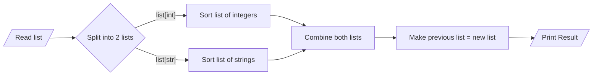

# 📝 Assignment 02 - Challenge Question
> **Course**: [Thapar's Machine Learning Summer School, 2025](https://www.thaparsummerschool.com/)
> 
> **Student Name**: Ikansh Mahajan
>
> **Student Roll No.**: 102303754

## 🔎 Question given
Write a Python program to sort a list of heterogenous data.

For example, `["Ram", 1, "Shyam", 2, "Aman", 3]` sorts to `[1, 2, 3, "Aman", "Ram", "Shyam"]` 

 - Question was provided in a structured PDF, uploaded in this repo.
 - Solution is implemented using **Python**, mainly through **Google Colab**.

## 🔬 Methodology

## 🚀 How to Run Notebook
Click on the    button on top of the notebook to open it in Google Colab and experiment with my solution by copying it to your Drive.

## 🧾 Reflections
This assignment gave me a hands-on exposure to _Exception Handling in Python_

## ⚠️ Report Issues
Create an issue ticket using the `Issues` section up above.
